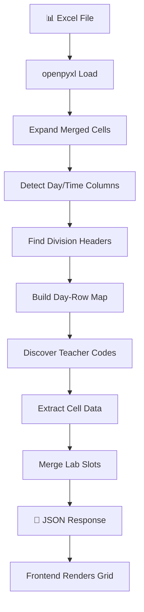

<div align="center">

# 📅 Timetable Extractor

### Smart Excel Timetable Parser with REST API

*Upload once, query infinitely. Extract teacher, division, and batch schedules from master Excel timetables with intelligent parsing and color-coded visualization.*

[](https://www.python.org/)
[](https://fastapi.tiangolo.com/)
[](LICENSE)

[Features](#-features) • [Quick Start](#-quick-start) • [API Docs](#-api-endpoints) • [Demo](#-demo)

</div>

---

## ✨ Features

<table>
<tr>
<td width="50%">

### 🎯 Smart Parsing
- **Auto-detection** of teachers, divisions & batches
- **Flexible format** support (merged cells, multiple time formats)
- **Lab merging** (2-hour slots automatically combined)
- **Room extraction** from cell content

</td>
<td width="50%">

### 🚀 Developer-Friendly
- **RESTful API** with FastAPI
- **Session-based** caching (1-hour expiry)
- **Interactive Swagger UI** at `/docs`
- **Zero-config frontend** (pure HTML/CSS/JS)

</td>
</tr>
</table>

---

## 🏗️ Project Structure

```
ExcelTimeTableExtractor/
│
├── 🐍 Backend (FastAPI)
│   ├── main.py              # API routes & session management
│   ├── parser_engine.py     # Excel parsing logic
│   ├── models.py            # Pydantic schemas
│   ├── utils.py             # Logging utilities
│   └── requirements.txt     # Python dependencies
│
└── 🎨 Frontend (Static)
    ├── index.html           # Main UI
    ├── style.css            # Modern dark theme
    └── script.js            # API integration
```

---

## 🚀 Quick Start

### Prerequisites

```bash
Python 3.11+
pip
```

### Installation

```bash
# Clone the repository
git clone <your-repo-url>
cd ExcelTimeTableExtractor

# Install dependencies
pip install -r requirements.txt
```

### Running the Application

#### 1️⃣ Start Backend (Port 8000)

```bash
uvicorn main:app --host 0.0.0.0 --port 8000 --reload
```

✅ API: `http://localhost:8000`  
✅ Swagger UI: `http://localhost:8000/docs`

#### 2️⃣ Start Frontend (Port 5500)

```bash
python -m http.server 5500
```

✅ Open: `http://localhost:5500`

> **Note:** To use a different backend URL, update `API_BASE` in `script.js`

---

## 📡 API Endpoints

### 📤 Upload & Session Management

| Method | Endpoint | Description |
|--------|----------|-------------|
| `POST` | `/upload` | Upload `.xlsx`/`.xlsm` → returns `session_id` |
| `DELETE` | `/session/{session_id}` | Delete specific session |
| `DELETE` | `/cache/clear` | Clear all sessions |

### 👨‍🏫 Teacher Queries

| Method | Endpoint | Description |
|--------|----------|-------------|
| `GET` | `/teachers/{session_id}` | List all detected teachers |
| `GET` | `/faculty` | Faculty code → name mapping |
| `GET` | `/timetable/teacher/{session_id}/{code}` | Teacher's weekly schedule |

### 🎓 Division & Batch Queries

| Method | Endpoint | Description |
|--------|----------|-------------|
| `GET` | `/timetable/division/{session_id}/{div}` | Division weekly schedule |
| `GET` | `/timetable/batch/{session_id}/{div}/{batch}` | Batch weekly schedule |

### 🔍 Extraction & Debug

| Method | Endpoint | Description |
|--------|----------|-------------|
| `GET` | `/extract/{session_id}` | Compact master schedule |
| `GET` | `/extract/full/{session_id}` | Per-teacher + per-division split |
| `GET` | `/extract/cell?text=...` | Parse single cell string |
| `GET` | `/debug/{session_id}` | Parser internal state |
| `GET` | `/debug/row/{session_id}/{row}` | Raw grid row data |

> 🕐 **Sessions expire after 1 hour** of inactivity

---

## 🧠 How It Works



### Parsing Pipeline Details

1. **Load Excel** → `openpyxl` with `data_only=True`
2. **Expand Merged Cells** → Create flat grid
3. **Detect Columns** → Frequency-based voting for day/time columns
4. **Find Divisions** → Regex match on `"FE - A (Comp)"` patterns
5. **Map Days** → Handle `Mon/Monday`, `Thurs/Thursday` variants
6. **Time Formats** → Support `HH:MM:SS`, `H:MM`, `H.MM`, `H.M`
7. **Teacher Discovery**:
   - Whitelist from `FACULTY_MAP`
   - Auto-detect 2-3 char ALL-CAPS codes (≥4 occurrences)
8. **Cell Extraction**:
   - Split on newlines/commas (respecting parentheses)
   - Extract teacher codes (prioritize parenthesized)
   - Extract divisions (`FE-A`, `SE-B`, etc.)
   - Extract room numbers
   - Clean subject names
9. **Lab Merging** → 2-hour slots with `span=2`
10. **JSON Output** → Frontend renders color-coded grid

---

## ⏰ Slot Configuration

| Time Key | Label | Type | Duration |
|----------|-------|------|----------|
| `8:30` | 8:30 AM | 🟦 Slot | 1 hour |
| `9:30` | 9:30 AM | 🟦 Slot | 1 hour |
| `BRK` | Break | 🟨 Break | 15 min |
| `10:45` | 10:45 AM | 🟦 Slot | 1 hour |
| `11:45` | 11:45 AM | 🟦 Slot | 1 hour |
| `LCH` | Lunch | 🟧 Lunch | 45 min |
| `1:30` | 1:30 PM | 🟦 Slot | 1 hour |
| `2:30` | 2:30 PM | 🟦 Slot | 1 hour |
| `3:30` | 3:30 PM | 🟦 Slot | 1 hour |

> **Tolerance:** ±20 minutes for slot matching

---

## 👨‍🏫 Adding Teachers

Edit `FACULTY_MAP` in `parser_engine.py`:

```python
FACULTY_MAP = {
    "AB": "Dr. Alice Brown",
    "CD": "Prof. Charlie Davis",
    "EF": "Ms. Emma Foster",
    # Add more...
}
```

The `/faculty` endpoint automatically serves this map to the frontend — **no frontend changes needed!**

---

## 🎨 Demo

### Upload Interface


### Teacher Timetable View


---

## 🐛 Troubleshooting

| 🚨 Problem | ✅ Solution |
|-----------|-----------|
| **CORS error** | Ensure backend is running and `API_BASE` in `script.js` matches |
| **No teachers found** | Codes must appear ≥4 times, or add to `FACULTY_MAP` |
| **Wrong slot assignment** | Time values must be within ±20 min of slot keys |
| **Slots showing as Free** | Upload fresh file after server restart (sessions not persisted) |
| **Lab not merging** | Cell must contain: `lab`, `pr`, `practical`, or `laboratory` |
| **File rejected** | Only `.xlsx` and `.xlsm` supported (not `.xls`) |

---

## 🚢 Production Deployment

### Security & Performance

- [ ] Set `allow_origins` in CORS to your actual domain
- [ ] Replace in-memory `_session_cache` with Redis/database
- [ ] Add file size validation (e.g., max 10MB)
- [ ] Enable rate limiting on upload endpoint
- [ ] Use environment variables for configuration

### Hosting Options

**Backend:**
- [Railway](https://railway.app/) (Recommended)
- [Render](https://render.com/)
- AWS EC2 / DigitalOcean VPS

**Frontend:**
- [Netlify](https://www.netlify.com/) (Drag & drop)
- [Vercel](https://vercel.com/)
- Nginx on same server as backend

---

## 🛠️ Tech Stack

<div align="center">


</div>

---

## 📝 License

This project is licensed under the MIT License - see the [LICENSE](LICENSE) file for details.

---

<div align="center">

### ⭐ Star this repo if you find it useful!

Made with ❤️ by cheron2000

[Report Bug](https://github.com/cheron2000/TimeTableExtractor/issues) • [Request Feature](https://github.com/cheron2000/TimeTableExtractor/issues)

</div>
